HBase

大数据3件事：海量数据的传输，计算，存储

# 第 1 章 HBase 简介 

## 一、HBase 定义 

HBase 是一种分布式、可扩展、支持海量数据存储的 NoSQL 数据库。 

## 二、HBase 数据模型 

逻辑上， HBase 的数据模型同关系型数据库很类似，数据存储在一张表中，有行有列。
但从 HBase 的底层物理存储结构（K-V） 来看， HBase 更像是一个 multi-dimensional map。 

### 1.HBase 逻辑结构 

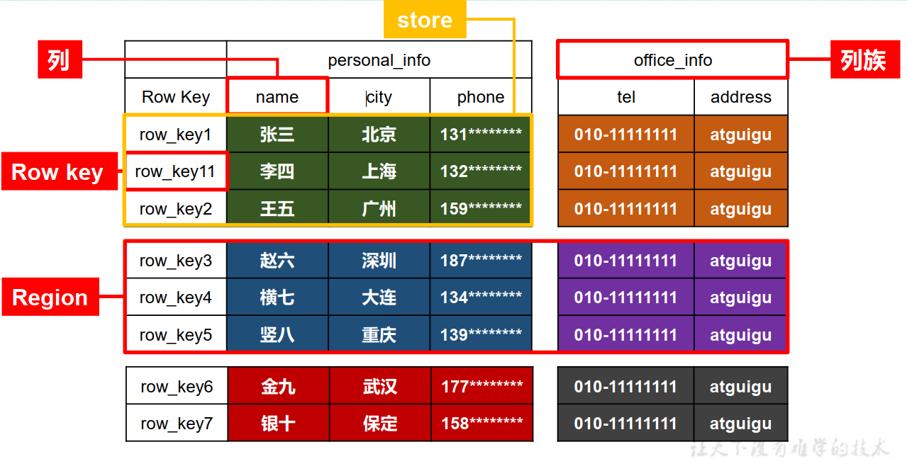

Row Key按照字典序进行排序

### 2.HBase 物理存储结构 

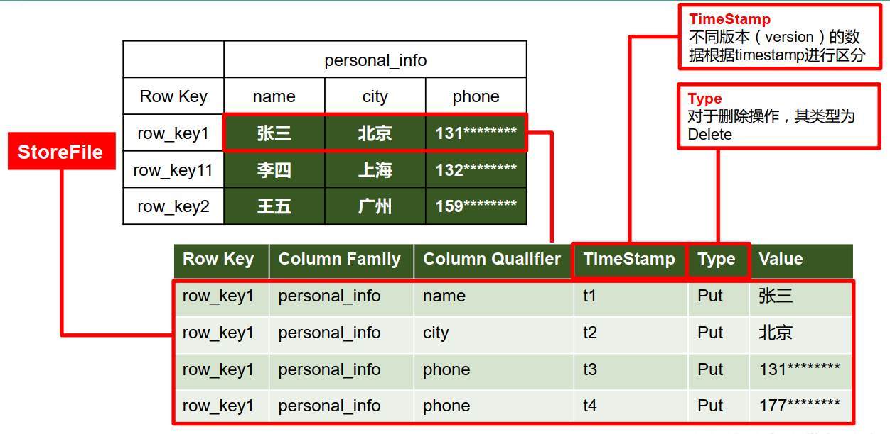

### 3.  数据模型  

  1） Name Space
命名空间，类似于关系型数据库的 DatabBase 概念，每个命名空间下有多个表。 HBase
有两个自带的命名空间，分别是 hbase 和 default， hbase 中存放的是 HBase 内置的表，
==default 表是用户默认使用的命名空间==。
2） Region
类似于关系型数据库的表概念。不同的是， HBase 定义表时只需要声明列族即可，不需
要声明具体的列。这意味着， 往 HBase 写入数据时，字段可以==动态、 按需==指定。因此，和关
系型数据库相比， HBase 能够轻松应对字段变更的场景。
3） Row
HBase 表中的每行数据都由一个 RowKey 和多个 Column（列）组成，数据是按照 RowKey
的==字典顺序==存储的，并且查询数据时只能根据 RowKey 进行检索，所以 RowKey 的设计十分重
要。
4） Column
HBase 中的每个列都由 ==Column Family(列族)和 Column Qualifier（列限定符）==进行限
定，例如 info： name， info： age。建表时，只需指明列族，而列限定符无需预先定义。
5） Time Stamp
用于标识数据的不同版本（version）， 每条数据写入时， 如果不指定时间戳， 系统会
自动为其加上该字段，其值为写入 HBase 的时间。  

  6） Cell
由{rowkey, column Family： column Qualifier, time Stamp} 唯一确定的单元。 cell 中的数
据是没有类型的，全部是字节码形式存贮。  

## 三、  HBase 基本架构  

master执行DDL操作，不是DML

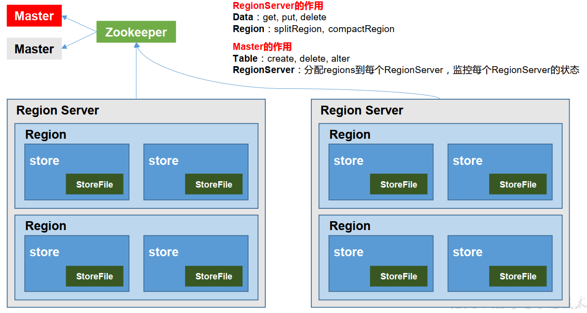

  架构角色：
1） Region Server
Region Server 为 Region 的管理者， 其实现类为 ==HRegionServer==，主要作用如下:
对于数据的操作： get, put, delete；
对于 Region 的操作： splitRegion、 compactRegion。
2） Master
Master 是所有 Region Server 的管理者，其实现类为 HMaster，主要作用如下：
对于表的操作： create, delete, alter
对于 RegionServer的操作：分配 regions到每个RegionServer，监控每个 RegionServer
的状态，负载均衡和故障转移。
3） Zookeeper
HBase 通过 Zookeeper 来做 Master 的高可用、 RegionServer 的监控、元数据的入口以及
集群配置的维护等工作。
4） HDFS
HDFS 为 HBase 提供最终的底层数据存储服务，同时为 HBase 提供高可用的支持。  

#   第 2 章 HBase 快速入门  

## 一、  HBase 安装部署  

### 1.参考

1. 见`尚硅谷大数据技术之HBase.pdf`
2. 见`Spark Streaming实时流处理项目实战.md`

### 2.启动

1. 启动zookeeper

   ```
   cd $ZK_HOME/bin
   ./zkServer.sh start
   ```

2. 启动Hadoop

3. 配置hbase

   解压
   
   ```
tar -zxvf hbase-1.3.1-bin.tar.gz -C ~/app/
   ```

   改名
   
   ```
   mv hbase-1.3.1/ hbase
   ```
   
     修改 HBase 对应的配置文件。  
   
   1）  hbase-env.sh 修改内容  
   
   ```
   vi hbase-env.sh
   ```
   
   ```
   export JAVA_HOME=/home/jungle/app/jdk1.8.0_152
   export HBASE_MANAGES_ZK=false
   ```
   
   
   
   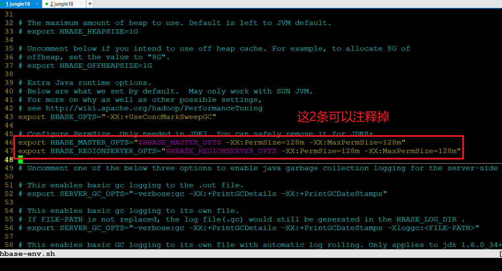

见`hbase-default.xml`

+   软连接 hadoop 配置文件到 HBase：  

  ```
  ln -s /home/jungle/app/hadoop-2.6.0-cdh5.7.0/etc/hadoop/core-site.xml /home/jungle/app/hbase-1.2.0-cdh5.7.0/conf/core-site.xml
  ln -s /home/jungle/app/hadoop-2.6.0-cdh5.7.0/etc/hadoop/hdfs-site.xml /home/jungle/app/hbase-1.2.0-cdh5.7.0/conf/hdfs-site.xml
  ```

  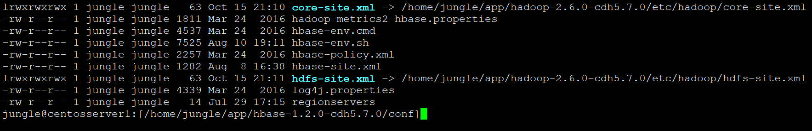

启动hbase

```
cd $HBASE_HOME/bin
./start-hbase.sh
```

```
http://192.168.1.18:60010
```

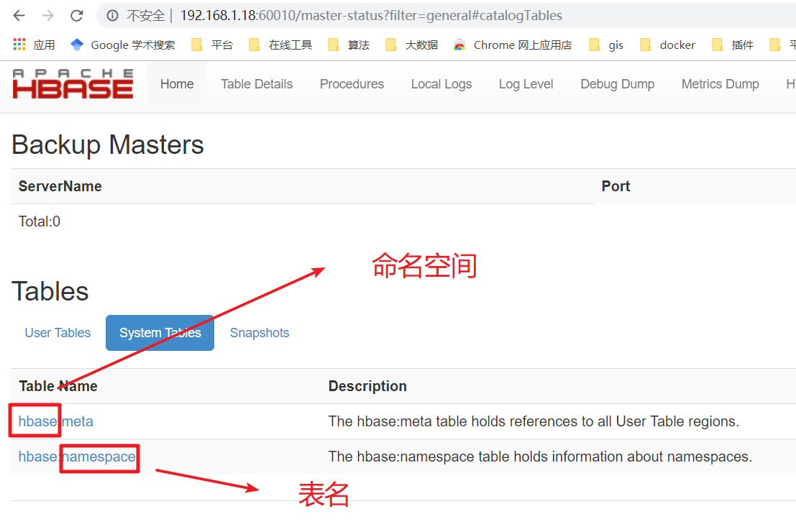


## 二、  HBase Shell 操作  

### 1.基本操作

1．进入 HBase 客户端命令行

```
bin/hbase shell
```

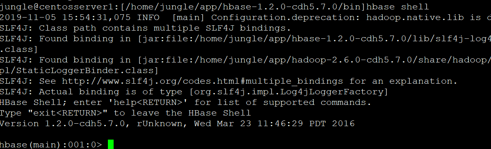2．查看帮助命令

```
help
```

3．查看当前数据库中有哪些表

```
list 
```

 ###   2 .表的操作  

1．创建表

```
create 'student','info'
```

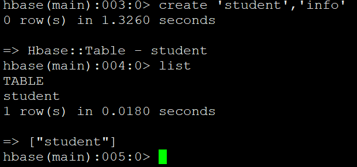

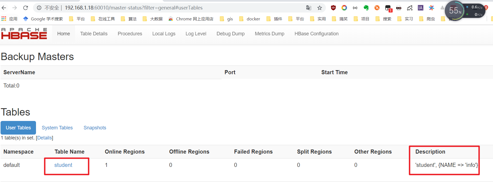

2．插入数据到表

```
# put 表名+row key+列簇·列·+数据
put 'student','1001','info:sex','male'
put 'student','1001','info:age','18'
put 'student','1002','info:name','Janna'
put 'student','1002','info:sex','female'
put 'student','1002','info:age','20'
```

3．扫描查看表数据

```
scan 'student'
# 左闭右开
scan 'student',{STARTROW => '1001', STOPROW =>
'1001'}
scan 'student',{STARTROW => '1001'}
```

4．查看表结构

```
describe 'student'
```

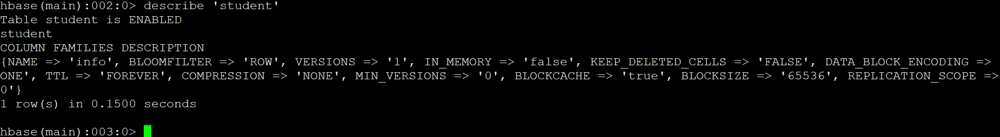

5．更新指定字段的数据

```
put 'student','1001','info:name','Nick'
put 'student','1001','info:age','100'
# 同时插入时间戳
# 返回最大时间戳的值
put 'student','1001','info:name','jungle',1563259047560
```

```
# 查看之前改掉的数据
scan 'student',{RAW => true,VERSIONS => 10}
```

6．查看“指定行”或“指定列族:列”的数据

```
get 'student','1001'
get 'student','1001','info:name'
```

7．统计表数据行数

```
count 'student'
```

8．删除数据  

  删除某 rowkey 的全部数据：

```
deleteall 'student','1001'
```

删除某 rowkey 的某一列数据：  

```
delete 'student','1002','info:sex'
```

9.创建命名空间

```
create_namespace 'bigdata'
list_namespace
```

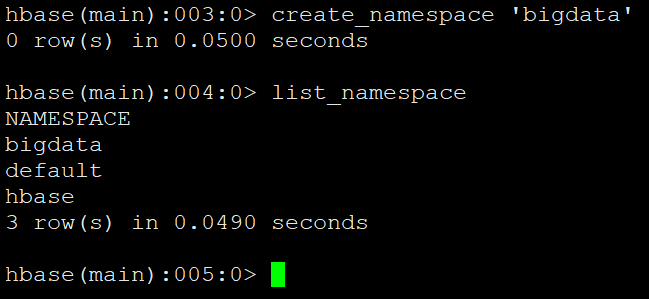

```
create 'bigdata:student','info'
```

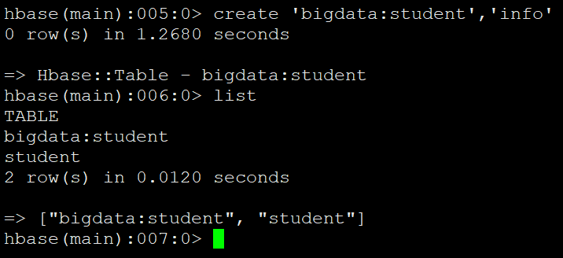

10.删除命名空间

```
disable 'bigdata:student'
drop 'bigdata:student'
drop_namespace 'bigdata'
```

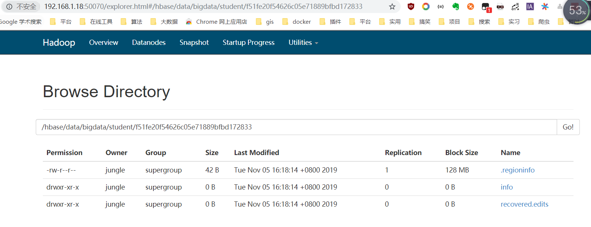

---

#   第 3 章 HBase 进阶  

## 一、架构原理

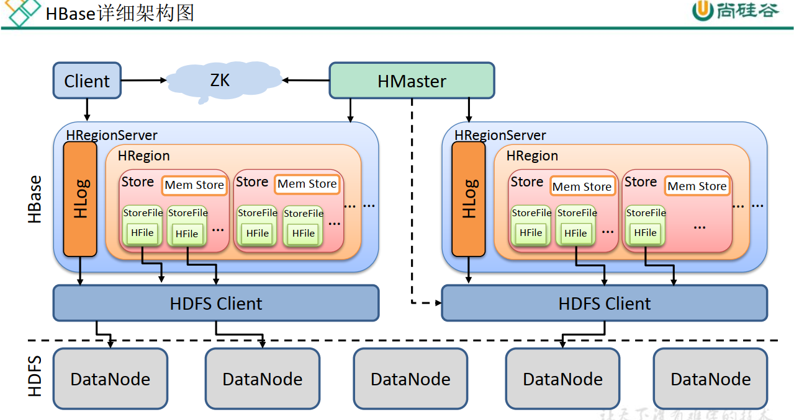

  1） StoreFile
保存实际数据的物理文件， StoreFile 以 HFile 的形式存储在 HDFS 上。每个 Store （列簇）会有
一个或多个 StoreFile（HFile），数据在每个 StoreFile 中都是有序的。
2） MemStore
写缓存， 由于 HFile （一种数据格式）中的数据要求是有序的， 所以数据是先存储在 MemStore 中，排好  序后，等到达刷写时机才会刷写到 HFile，每次刷写都会形成一个新的 HFile。  

  3） WAL
由于数据要经 MemStore 排序后才能刷写到 HFile， 但把数据保存在内存中会有很高的
概率导致数据丢失，为了解决这个问题，数据会先写在一个叫做 Write-Ahead logfile 的文件
中，然后再写入 MemStore 中。所以在系统出现故障的时候，数据可以通过这个日志文件重
建。  

## 二、写流程

读比写慢

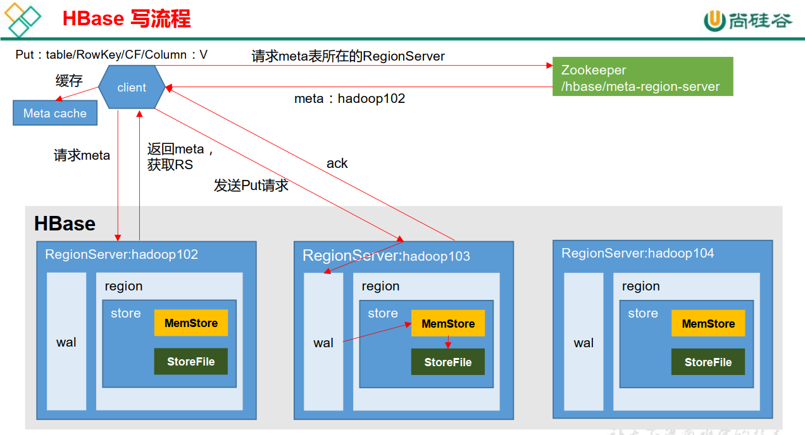

  写流程：
1） Client 先访问 zookeeper，获取 hbase:meta 表位于哪个 Region Server。
2）访问对应的 Region Server，获取 hbase:meta 表，根据读请求的 namespace:table/rowkey，
查询出目标数据位于哪个 Region Server 中的哪个 Region 中。并将该 table 的 region 信息以
及 meta 表的位置信息缓存在客户端的 meta cache，方便下次访问。
3）与目标 Region Server 进行通讯；
4）将数据顺序写入（追加）到 WAL；
5）将数据写入对应的 MemStore，数据会在 MemStore 进行排序；
6）向客户端发送 ack；
7） 等达到 MemStore 的刷写时机后，将数据刷写到 HFile。  

---

```
cd /home/jungle/app/zookeeper-3.4.5-cdh5.7.0
bin/zkCli.sh
```

```
ls /
```

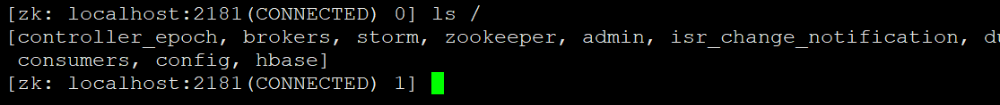

```
ls /hbase
```

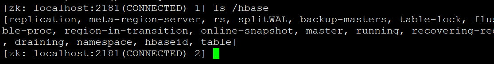

```
get /hbase/meta-region-server
```

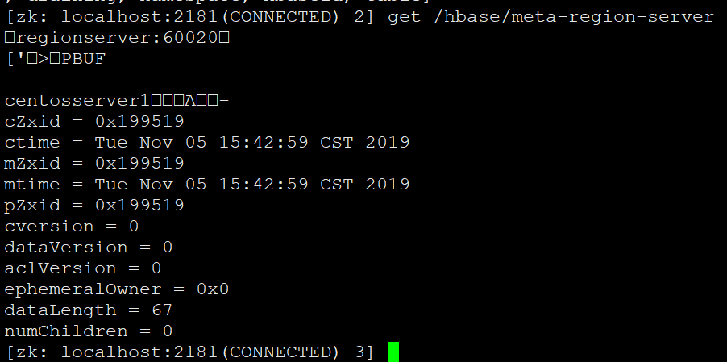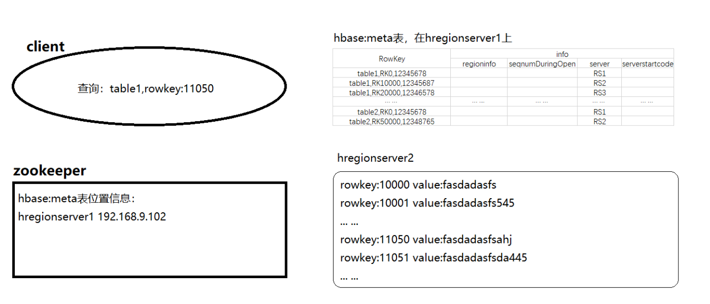

 ## 三、MemStore Flush  

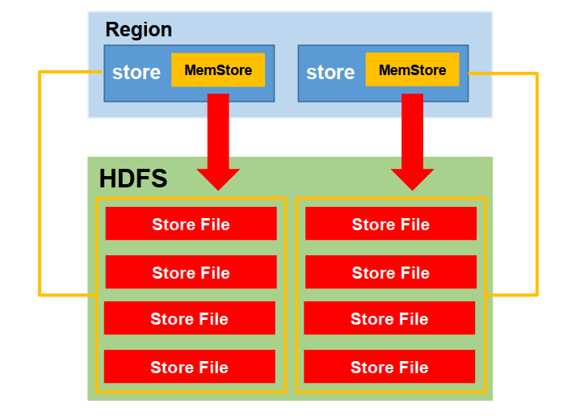


#   第 4 章 HBase API  


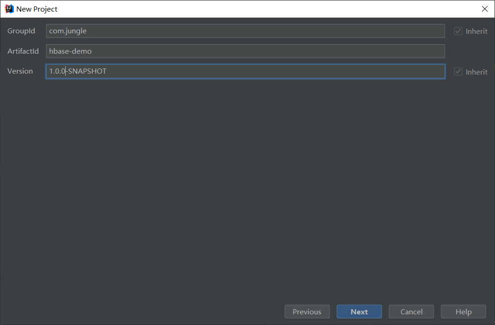

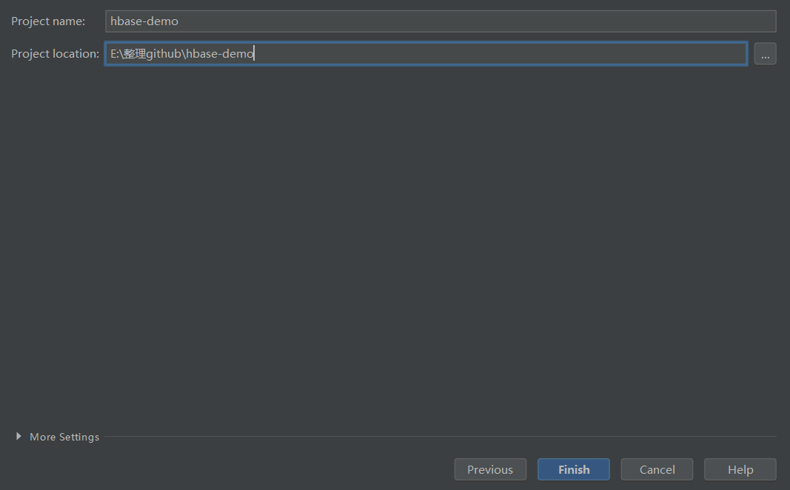

pom.xml

```xml
<?xml version="1.0" encoding="UTF-8"?>
<project xmlns="http://maven.apache.org/POM/4.0.0"
         xmlns:xsi="http://www.w3.org/2001/XMLSchema-instance"
         xsi:schemaLocation="http://maven.apache.org/POM/4.0.0 http://maven.apache.org/xsd/maven-4.0.0.xsd">
    <modelVersion>4.0.0</modelVersion>

    <groupId>com.jungle</groupId>
    <artifactId>hbase-demo</artifactId>
    <version>1.0.0-SNAPSHOT</version>
    <properties>
        <hbase.version>1.2.0-cdh5.7.0</hbase.version>
    </properties>
    <repositories>
        <repository>
            <id>cloudera</id>
            <name>cloudera Repository</name>
            <url>https://repository.cloudera.com/artifactory/cloudera-repos</url>
        </repository>
    </repositories>
<dependencies>
    <dependency>
        <groupId>org.apache.hbase</groupId>
        <artifactId>hbase-client</artifactId>
        <version>${hbase.version}</version>
    </dependency>
    <dependency>
        <groupId>org.apache.hbase</groupId>
        <artifactId>hbase-server</artifactId>
        <version>${hbase.version}</version>
    </dependency>
</dependencies>

</project>
```

--TestAPI.java

```java
package com.jungle.test;

import org.apache.hadoop.conf.Configuration;
import org.apache.hadoop.hbase.*;
import org.apache.hadoop.hbase.client.*;
import org.apache.hadoop.hbase.protobuf.generated.HBaseProtos;
import org.apache.hadoop.hbase.util.Bytes;

import java.io.IOException;
import java.util.Scanner;

/**
 * DDL:
 * 1.判断表是否存在
 * 2.创建表
 * 3.创建命名空间
 * 4.删除表
 *
 * DML:
 * 5.插入数据
 * 6.查数据（get）
 * 7.查数据（get）
 * 8.删除数据
 *
 */
public class TestAPI {


    private static Connection connection = null;
    private static Admin admin = null;


    /**
     * 初始化
     */
    static {

        try {
            //1.获取配置文件信息
            Configuration configuration = HBaseConfiguration.create();
            configuration.set("hbase.zookeeper.quorum","centosserver1");

            //2.获取管理员对象
            connection = ConnectionFactory.createConnection(configuration);

            //3.创建Admin对象
            admin = connection.getAdmin();

        } catch (IOException e) {
            e.printStackTrace();
        }

    }
    /**
     * 1.判断表是否存在
     * @param tableName
     * @return
     */
    public static boolean isTableExist(String tableName) throws IOException {

//        //1.获取配置文件信息
////        HBaseConfiguration configuration = new HBaseConfiguration();
//        Configuration configuration = HBaseConfiguration.create();
//        configuration.set("hbase.zookeeper.quorum","centosserver1");
//
//        //2.获取管理员对象
////        HBaseAdmin admin = new HBaseAdmin(configuration);
//        Connection connection = ConnectionFactory.createConnection(configuration);
//        Admin admin = connection.getAdmin();

        //3.判断表是否存在
//        boolean exists = admin.tableExists(tableName);
        boolean exists = admin.tableExists(TableName.valueOf(tableName));

        //4.关闭连接
//        admin.close();

        //5.返回结果
        return exists;


    }

    /**
     * 2.创建表
     * @param tableName 表名
     * @param cfs 列簇
     */
    public static void createTable(String tableName,String... cfs) throws IOException {

        //1.判断是否存在列簇信息
        if (cfs.length <= 0) {
            System.out.println("请设置列簇信息！");
            return;
        }

        //2.判断表是否存在
        if (isTableExist(tableName)) {
            System.out.println(tableName + "表已存在");
            return;
        }

        //3.创建表描述器
        HTableDescriptor hTableDescriptor = new HTableDescriptor(TableName.valueOf(tableName));

        //4.循环添加列族信息
        for (String cf : cfs) {

            //5.创建列族描述器
            HColumnDescriptor hColumnDescriptor = new HColumnDescriptor(cf);

            //6.添加具体的列簇信息
            hTableDescriptor.addFamily(hColumnDescriptor);
        }

        //7.创建表
        admin.createTable(hTableDescriptor);


    }

    /**
     * 3.删除表
     * @param tableName
     */
    public static void dropTable(String tableName) throws IOException {

        //1.判断表是否存在
        if (!isTableExist(tableName)) {
            System.out.println(tableName + "表不存在！！！！");
            return;
        }

        //2.使表下线
        admin.disableTable(TableName.valueOf(tableName));

        //3.删除表
        admin.deleteTable(TableName.valueOf(tableName));
    }

    /**
     * 4.创建命名空间
     * @param ns
     */
    public static void createNameSpace(String ns) {

        //1.创建命名空间描述器
        NamespaceDescriptor namespaceDescriptor = NamespaceDescriptor.create(ns).build();

        //2.创建命名空间
        try {
            admin.createNamespace(namespaceDescriptor);
        }catch (NamespaceExistException e){

            System.out.println(ns + "命名空间已存在");
        } catch (IOException e) {
            e.printStackTrace();
        }
    }

    /**
     * 5.向表插入数据
     * @param tableName
     * @param rowKey
     * @param cf
     * @param cn
     * @param value
     */
    public static void putData(String tableName,String rowKey,String cf,String cn,String value) throws IOException {

        //1.获取表对象
        Table table = connection.getTable(TableName.valueOf(tableName));

        //2.创建Put对象
        Put put = new Put(Bytes.toBytes(rowKey));

        //3.给Put对象赋值
        put.addColumn(Bytes.toBytes(cf),Bytes.toBytes(cn),Bytes.toBytes(value));

        //4.插入数据
        table.put(put);

        //5.关闭表连接
        table.close();

    }

    /**
     * 6.获取数据（get）
     * @param tableName
     * @param rowKey
     * @param cn
     * @throws IOException
     */
    public static void getData(String tableName,String rowKey,String cf,String cn) throws IOException {

        //1.获取表对象
        Table table = connection.getTable(TableName.valueOf(tableName));

        //2.创建Get对象
        Get get = new Get(Bytes.toBytes(rowKey));

        //2.1 指定获取的列族
//        get.addFamily(Bytes.toBytes(cf));

        //2.2 指定列簇和列
        get.addColumn(Bytes.toBytes(cf),Bytes.toBytes(cn));

        //2.3 设置获取数据的版本数
        get.setMaxVersions(5);

        //3.获取数据
        Result result = table.get(get);

        //4.解析result并打印
        for (Cell cell : result.rawCells()) {

            //5.打印数据
            System.out.println("CF:"+Bytes.toString(CellUtil.cloneFamily(cell))+
                    ",CN:" + Bytes.toString(CellUtil.cloneQualifier(cell))+
                    ",Value:" + Bytes.toString(CellUtil.cloneValue(cell))

                    );
        }

        //6.关闭表连接
        table.close();
    }


    /**
     * 7.获取数据（scan）
     * @param tableName
     * @throws IOException
     */
    public static void scanTable(String tableName) throws IOException {

        //1.获取表对象
        Table table = connection.getTable(TableName.valueOf(tableName));

        //2.构建Scan对象
//        Scan scan = new Scan();
        Scan scan = new Scan(Bytes.toBytes("1001"),Bytes.toBytes("1020"));

        //3.扫描表
        ResultScanner resultScanner = table.getScanner(scan);

        //4.解析resultScanner
        for (Result result : resultScanner) {

            //5.解析result并打印
            for (Cell cell : result.rawCells()) {

                //6.打印数据
                System.out.println("RK:" + Bytes.toString(CellUtil.cloneRow(cell)) +
                        ",CF:"+Bytes.toString(CellUtil.cloneFamily(cell))+
                        ",CN:" + Bytes.toString(CellUtil.cloneQualifier(cell))+
                        ",Value:" + Bytes.toString(CellUtil.cloneValue(cell))

                );

            }
        }
        //7.关闭表连接
        table.close();
    }

    /**
     * 8.删除数据
     * @param tableName
     * @param rowKey
     * @param cf
     * @param cn
     */
    public static void deleteData(String tableName,String rowKey,String cf,String cn) throws IOException {

        //1.获取表对象
        Table table = connection.getTable(TableName.valueOf(tableName));

        //2.构建删除对象
        Delete delete = new Delete(Bytes.toBytes(rowKey));

        //2.1 设置删除的列
//        delete.addColumn(Bytes.toBytes(cf),Bytes.toBytes(cn),1573368881383L);

        //2.2 删除指定列族
        delete.addFamily(Bytes.toBytes(cf));

        //3.执行删除操作
        table.delete(delete);

        //4.关闭连接
        table.close();
    }

    /**
     * 关闭资源
     */
    public static void close(){
        if (admin != null) {
            try {
                admin.close();
            } catch (IOException e) {
                e.printStackTrace();
            }
        }

        if (connection != null) {
            try {
                connection.close();
            } catch (IOException e) {
                e.printStackTrace();
            }
        }
    }


    public static void main(String[] args) throws IOException {

        //1.测试表是否存在
        System.out.println(isTableExist("stu5"));

        //2.创建表测试
//        createTable("stu5","info1","info2");
        createTable("0408:stu5","info1","info2");

        //3.删除表测试
        dropTable("stu5");

        //4.创建命名空间测试
        createNameSpace("0408");

        //5.创建数据测试
        putData("student","1004","info","sex","nan");

        //6.获取单行数据
        getData("student","1001","info","sex");


        //7.测试扫描数据
        scanTable("student");

        //8.测试删除
        deleteData("student","1004","","");
//        System.out.println(isTableExist("stu5"));


        close();
    }
}

```

## 一、  官方 HBase-MapReduce  

  1． 查看 HBase 的 MapReduce 任务的执行

```
bin/hbase mapredcp
```

2. 永久生效：在/etc/profile 配置

```
export HBASE_HOME=/opt/module/hbase
export HADOOP_HOME=/opt/module/hadoop-2.7.2  
```

==并在 hadoop-env.sh 中配置：（注意：在 for 循环之后配）==  

```
vi /home/jungle/app/hadoop-2.6.0-cdh5.7.0/etc/hadoop/hadoop-env.sh
```

```
export HADOOP_CLASSPATH=$HADOOP_CLASSPATH:/home/jungle/app/hbase-1.2.0-cdh5.7.0/lib/* 
```

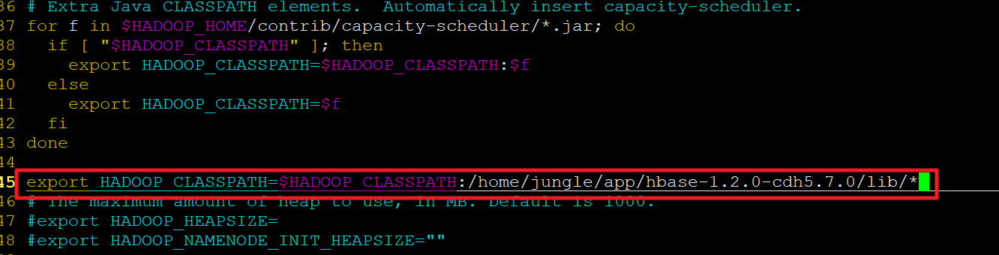

3. 重启hbase和hadoop

```
cd /home/jungle/app/hbase-1.2.0-cdh5.7.0/bin
./stop-hbase.sh
```

```
cd $HADOOP_HOME/sbin
./stop-all.sh
```

```
cd $HADOOP_HOME/sbin
./start-all.sh
```

```
cd /home/jungle/app/hbase-1.2.0-cdh5.7.0/bin
./start-hbase.sh
```

---


### 1.运行官方的 MapReduce 任务
-- 案例一：统计 Student 表中有多少行数据

```
/home/jungle/app/hadoop-2.6.0-cdh5.7.0/bin/yarn jar /home/jungle/app/hbase-1.2.0-cdh5.7.0/lib/hbase-server-1.2.0-cdh5.7.0.jar rowcounter student
```

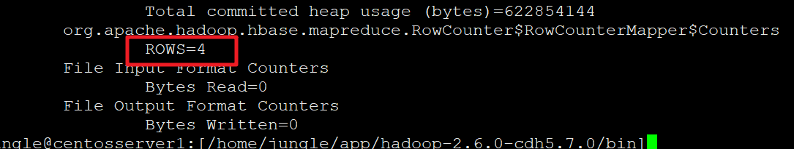

  -- 案例二：使用 MapReduce 将本地数据导入到 HBase  

  1）在本地创建一个 tsv 格式的文件： fruit.tsv  

```
hadoop fs -put fruit.tsv /
```

```
1001 Apple Red
1002 Pear Yellow
1003 Pineapple Yellow
```

  2）创建 Hbase 表  

```
create 'fruit','info'
```

  3）在 HDFS 中创建 input_fruit 文件夹并上传 fruit.tsv 文件  

```
hadoop fs -put fruit /
```

  4） 执行 MapReduce 到 HBase 的 fruit 表中  

```
/home/jungle/app/hadoop-2.6.0-cdh5.7.0/bin/yarn jar /home/jungle/app/hbase-1.2.0-cdh5.7.0/lib/hbase-server-1.2.0-cdh5.7.0.jar importtsv -Dimporttsv.columns=HBASE_ROW_KEY,info:name,info:color fruit hdfs://centosserver1:8020/fruit.tsv
```

  5） 使用 scan 命令查看导入后的结果  

```
scan ‘fruit’
```

## 二、自定义 Hbase-MapReduce2  

### 1. hdfs => hbase

+ 在hbase中建表

```
create 'fruit2','info'
```

+ 程序

--FruitMapper.java

```java
package com.jungle.mr1;

import org.apache.hadoop.io.LongWritable;
import org.apache.hadoop.io.Text;
import org.apache.hadoop.mapreduce.Mapper;

import java.io.IOException;

public class FruitMapper extends Mapper<LongWritable, Text, LongWritable, Text> {

//    直接写出去
    @Override
    protected void map(LongWritable key, Text value, Context context) throws IOException, InterruptedException {

        context.write(key,value);
    }
}

```

--FruitReducer.java

```java
package com.jungle.mr1;

import org.apache.hadoop.hbase.client.Put;
import org.apache.hadoop.hbase.mapreduce.TableReducer;
import org.apache.hadoop.hbase.util.Bytes;
import org.apache.hadoop.io.LongWritable;
import org.apache.hadoop.io.NullWritable;
import org.apache.hadoop.io.Text;

import java.io.IOException;

public class FruitReducer extends TableReducer<LongWritable, Text, NullWritable> {


    @Override
    protected void reduce(LongWritable key, Iterable<Text> values, Context context) throws IOException, InterruptedException {

       //1.遍历values:1001 Apple Red
        for (Text value : values) {

            //2.获取每一行数据
            String[] fields = value.toString().split("\\s+");
            for (String field : fields) {
                System.out.println(field);
            }


            //3.构建put对象
            Put put = new Put(Bytes.toBytes(fields[0]));

            //4.给put对象赋值
            put.addColumn(Bytes.toBytes("info"), Bytes.toBytes("name"), Bytes.toBytes(fields[1]));
            put.addColumn(Bytes.toBytes("info"), Bytes.toBytes("color"), Bytes.toBytes(fields[2]));

            //5.写出
            context.write(NullWritable.get(),put);
        }
    }
}

```

---FruitDriver.java

```java
package com.jungle.mr1;

import org.apache.hadoop.conf.Configuration;
import org.apache.hadoop.fs.Path;
import org.apache.hadoop.hbase.mapreduce.TableMapReduceUtil;
import org.apache.hadoop.io.LongWritable;
import org.apache.hadoop.io.Text;
import org.apache.hadoop.mapreduce.Job;
import org.apache.hadoop.mapreduce.lib.input.FileInputFormat;
import org.apache.hadoop.util.Tool;
import org.apache.hadoop.util.ToolRunner;

public class FruitDriver implements Tool {


    //定义一个Configuration
    private Configuration configuration = null;

    public int run(String[] args) throws Exception {

        //1.获取job对象
        Job job = Job.getInstance(configuration);

        //2.设置驱动类路径
        job.setJarByClass(FruitDriver.class);

        //3.设置Mapper&Mapper输出KV类型
        job.setMapperClass(FruitMapper.class);
        job.setMapOutputKeyClass(LongWritable.class);
        job.setMapOutputValueClass(Text.class);

        //4.设置Mapper类
        TableMapReduceUtil.initTableReducerJob(args[1],FruitReducer.class,job);


        //5.设置输入参数
        FileInputFormat.setInputPaths(job,new Path(args[0]));

        //6.提交方法
        boolean result = job.waitForCompletion(true);

        return result?0:1;
    }

    public void setConf(Configuration conf) {

        configuration =conf;
    }

    public Configuration getConf() {
        return configuration;
    }

    public static void main(String[] args) {


        try {
            Configuration configuration = new Configuration();
            int run = ToolRunner.run(configuration, new FruitDriver(), args);
            System.exit(run);
        } catch (Exception e) {
            e.printStackTrace();
        }

    }
}

```

==打成jar运行==

```
/home/jungle/app/hadoop-2.6.0-cdh5.7.0/bin/yarn jar hbase-demo-1.0.0-SNAPSHOT.jar com.jungle.mr1.FruitDriver /fruit.tsv fruit2
```

---

### 2. hbase => hbase

1. 服务器运行

-----Fruit2Mapper.java

```java
package com.jungle.mr2;

import org.apache.hadoop.hbase.Cell;
import org.apache.hadoop.hbase.CellUtil;
import org.apache.hadoop.hbase.client.Put;
import org.apache.hadoop.hbase.client.Result;
import org.apache.hadoop.hbase.io.ImmutableBytesWritable;
import org.apache.hadoop.hbase.mapreduce.TableMapper;
import org.apache.hadoop.hbase.util.Bytes;
import org.apache.hadoop.io.LongWritable;
import org.apache.hadoop.io.Text;
import org.apache.hadoop.mapreduce.Mapper;

import java.io.IOException;

public class Fruit2Mapper extends TableMapper<ImmutableBytesWritable, Put> {

//    ImmutableBytesWritable key 是rowkey
    @Override
    protected void map(ImmutableBytesWritable key, Result value, Context context) throws IOException, InterruptedException {

        //构建Put对象
        Put put = new Put(key.get());

        //1.获取数据
        for (Cell cell : value.rawCells()) {

            //2.判断当前cell是否“name”列
            if ("name".equals(Bytes.toString(CellUtil.cloneQualifier(cell)))) {

                //3.给Put对象赋值
                put.add(cell);
            }
        }

        //4.写出
        context.write(key,put);
    }
}

```

--Fruit2Reducer.java

```java
package com.jungle.mr2;

import org.apache.hadoop.hbase.client.Put;
import org.apache.hadoop.hbase.io.ImmutableBytesWritable;
import org.apache.hadoop.hbase.mapreduce.TableReducer;
import org.apache.hadoop.hbase.util.Bytes;
import org.apache.hadoop.io.LongWritable;
import org.apache.hadoop.io.NullWritable;
import org.apache.hadoop.io.Text;

import java.io.IOException;

public class Fruit2Reducer extends TableReducer<ImmutableBytesWritable, Put, NullWritable> {


    @Override
    protected void reduce(ImmutableBytesWritable key, Iterable<Put> values, Context context) throws IOException, InterruptedException {

        //遍历写出
        for (Put value : values) {

            context.write(NullWritable.get(),value);
        }
    }
}

```

---Fruit2Driver.java

```java
package com.jungle.mr2;

import com.jungle.mr1.FruitReducer;
import org.apache.hadoop.conf.Configuration;
import org.apache.hadoop.fs.Path;
import org.apache.hadoop.hbase.HBaseConfiguration;
import org.apache.hadoop.hbase.client.Put;
import org.apache.hadoop.hbase.client.Scan;
import org.apache.hadoop.hbase.io.ImmutableBytesWritable;
import org.apache.hadoop.hbase.mapreduce.TableMapReduceUtil;
import org.apache.hadoop.mapreduce.Job;
import org.apache.hadoop.mapreduce.lib.input.FileInputFormat;
import org.apache.hadoop.util.Tool;
import org.apache.hadoop.util.ToolRunner;

public class Fruit2Driver implements Tool {


    //定义配置信息；一个Configuration
    private Configuration configuration = null;

    public int run(String[] args) throws Exception {

        //1.获取job对象
        Job job = Job.getInstance(configuration);

        //2.设置驱动类路径
        job.setJarByClass(Fruit2Driver.class);

        //3.设置Mapper&Mapper输出KV类型
        TableMapReduceUtil.initTableMapperJob("fruit2",
                new Scan(),   //空参代表全表扫描
                Fruit2Mapper.class,
                ImmutableBytesWritable.class,
                Put.class,
                job);
        //4.设置Ruducer&输出的表
        TableMapReduceUtil.initTableReducerJob("fruit",Fruit2Reducer.class,job);

        //6.提交任务
        boolean result = job.waitForCompletion(true);

        return result?0:1;
    }

    public void setConf(Configuration conf) {

        configuration =conf;
    }

    public Configuration getConf() {
        return configuration;
    }

    public static void main(String[] args) {


        try {
//            Configuration configuration = new Configuration();
            Configuration configuration = HBaseConfiguration.create();
            int run = ToolRunner.run(configuration, new Fruit2Driver(), args);
            System.exit(run);
        } catch (Exception e) {
            e.printStackTrace();
        }

    }
}

```

2. 本地运行

--Fruit2Driver.java

```java
package com.jungle.mr2;

import com.jungle.mr1.FruitReducer;
import org.apache.hadoop.conf.Configuration;
import org.apache.hadoop.fs.Path;
import org.apache.hadoop.hbase.client.Put;
import org.apache.hadoop.hbase.client.Scan;
import org.apache.hadoop.hbase.io.ImmutableBytesWritable;
import org.apache.hadoop.hbase.mapreduce.TableMapReduceUtil;
import org.apache.hadoop.mapreduce.Job;
import org.apache.hadoop.mapreduce.lib.input.FileInputFormat;
import org.apache.hadoop.util.Tool;
import org.apache.hadoop.util.ToolRunner;

public class Fruit2Driver implements Tool {


    //定义配置信息；一个Configuration
    private Configuration configuration = null;

    public int run(String[] args) throws Exception {

        //1.获取job对象
        Job job = Job.getInstance(configuration);

        //2.设置驱动类路径
        job.setJarByClass(Fruit2Driver.class);

        //3.设置Mapper&Mapper输出KV类型
        TableMapReduceUtil.initTableMapperJob(args[0],
                new Scan(),   //空参代表全表扫描
                Fruit2Mapper.class,
                ImmutableBytesWritable.class,
                Put.class,
                job);
        //4.设置Ruducer&输出的表
        TableMapReduceUtil.initTableReducerJob(args[1],Fruit2Reducer.class,job);

        //6.提交任务
        boolean result = job.waitForCompletion(true);

        return result?0:1;
    }

    public void setConf(Configuration conf) {

        configuration =conf;
    }

    public Configuration getConf() {
        return configuration;
    }

    public static void main(String[] args) {


        try {
            Configuration configuration = new Configuration();
            int run = ToolRunner.run(configuration, new Fruit2Driver(), args);
            System.exit(run);
        } catch (Exception e) {
            e.printStackTrace();
        }

    }
}

```

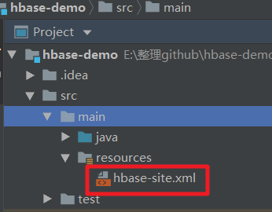

--hbase-site.xml

```xml
<?xml version="1.0"?>
<?xml-stylesheet type="text/xsl" href="configuration.xsl"?>
<!--
/**
 *
 * Licensed to the Apache Software Foundation (ASF) under one
 * or more contributor license agreements.  See the NOTICE file
 * distributed with this work for additional information
 * regarding copyright ownership.  The ASF licenses this file
 * to you under the Apache License, Version 2.0 (the
 * "License"); you may not use this file except in compliance
 * with the License.  You may obtain a copy of the License at
 *
 *     http://www.apache.org/licenses/LICENSE-2.0
 *
 * Unless required by applicable law or agreed to in writing, software
 * distributed under the License is distributed on an "AS IS" BASIS,
 * WITHOUT WARRANTIES OR CONDITIONS OF ANY KIND, either express or implied.
 * See the License for the specific language governing permissions and
 * limitations under the License.
 */
-->
<configuration>
    <property>
        <name>hbase.rootdir</name>
        <value>hdfs://192.168.1.18:8020/hbase</value>
    </property>

    <property>
        <name>hbase.cluster.distributed</name>
        <value>true</value>
    </property>

    <property>
        <name>hbase.zookeeper.quorum</name>
        <value>192.168.1.18:2181</value>
    </property>


</configuration>

```


## 三、  HBase 与 Hive 集成使用  

  Hive 需要持有操作HBase 的 Jar，那么接下来拷贝 Hive 所依赖的 Jar 包（或者使用软连接的形式）。  

```
ln -s $HBASE_HOME/lib/hbase-common-1.2.0-cdh5.7.0.jar $HIVE_HOME/lib/hbase-common-1.2.0-cdh5.7.0.jar
ln -s $HBASE_HOME/lib/hbase-server-1.2.0-cdh5.7.0.jar $HIVE_HOME/lib/hbase-server-1.2.0-cdh5.7.0.jar
ln -s $HBASE_HOME/lib/hbase-client-1.2.0-cdh5.7.0.jar $HIVE_HOME/lib/hbase-client-1.2.0-cdh5.7.0.jar
ln -s $HBASE_HOME/lib/hbase-protocol-1.2.0-cdh5.7.0.jar $HIVE_HOME/lib/hbase-protocol-1.2.0-cdh5.7.0.jar
ln -s $HBASE_HOME/lib/hbase-it-1.2.0-cdh5.7.0.jar $HIVE_HOME/lib/hbase-it-1.2.0-cdh5.7.0.jar
ln -s $HBASE_HOME/lib/htrace-core-3.2.0-incubating.jar $HIVE_HOME/lib/htrace-core-3.2.0-incubating.jar
ln -s $HBASE_HOME/lib/hbase-hadoop2-compat-1.2.0-cdh5.7.0.jar $HIVE_HOME/lib/hbase-hadoop2-compat-1.2.0-cdh5.7.0.jar
ln -s $HBASE_HOME/lib/hbase-hadoop-compat-1.2.0-cdh5.7.0.jar $HIVE_HOME/lib/hbase-hadoop-compat-1.2.0-cdh5.7.0.jar
```

  同时在 hive-site.xml 中修改 zookeeper 的属性，如下：  

```
vi/home/jungle/app/hive-1.1.0-cdh5.7.0/conf/hive-site.xml
```

```xml
<property>
	<name>hive.zookeeper.quorum</name>
	<value>centosserver1</value>
	<description>The list of ZooKeeper servers to talk to. This is
	only needed for read/write locks.</description>
</property>
<property>
	<name>hive.zookeeper.client.port</name>
	<value>2181</value>
	<description>The port of ZooKeeper servers to talk to. This is
	only needed for read/write locks.</description>
</property>
```

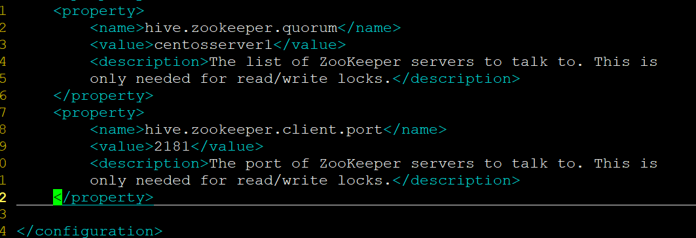

### 1.  案例一  

  ==目标==： 建立 Hive 表，关联 HBase 表，插入数据到 Hive 表的同时能够影响 HBase 表。
分步实现：
(1) 在 Hive 中创建表同时关联 HBase  

```
hbase shell
```

```
CREATE TABLE hive_hbase_emp_table(
empno int,
ename string,
job string,
mgr int,
hiredate string,
sal double,
comm double,
deptno int)
STORED BY 'org.apache.hadoop.hive.hbase.HBaseStorageHandler'
WITH SERDEPROPERTIES ("hbase.columns.mapping" =
":key,info:ename,info:job,info:mgr,info:hiredate,info:sal,info:co
mm,info:deptno")
TBLPROPERTIES ("hbase.table.name" = "hbase_emp_table");
```

  提示： 完成之后，可以分别进入 Hive 和 HBase 查看，都生成了对应的表  

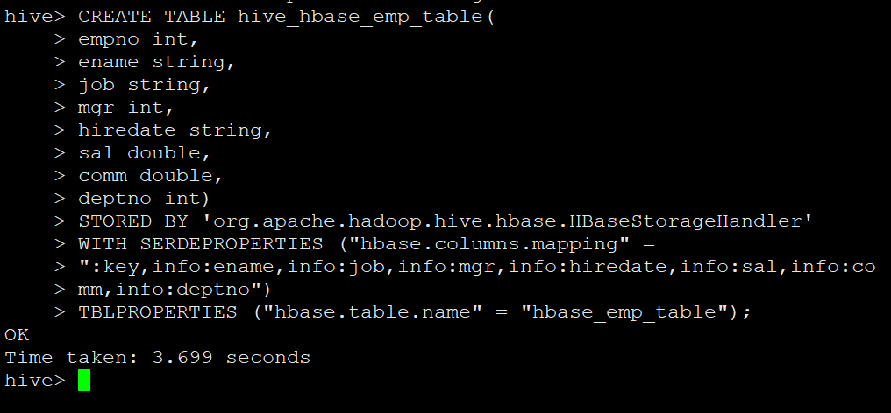

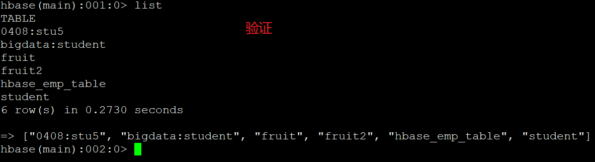

  (2) 在 Hive 中创建临时中间表，用于 load 文件中的数据
提示： 不能将数据直接 load 进 Hive 所关联 HBase 的那张表中  

```sql
CREATE TABLE emp(
empno int,
ename string,
job string,
mgr int,
hiredate string,
sal double,
comm double,
deptno int)
row format delimited fields terminated by '\t';
```

  (3) 向 Hive 中间表中 load 数据  

```
hive> load data local inpath '/home/admin/softwares/data/emp.txt'
into table emp;
```

  (4) 通过 insert 命令将中间表中的数据导入到 Hive 关联 Hbase 的那张表中  

```
hive> insert into table hive_hbase_emp_table select * from emp;
```

  (5) 查看 Hive 以及关联的 HBase 表中是否已经成功的同步插入了数据
Hive：  

```
hive> select * from hive_hbase_emp_table;
```

  HBase：  

```
Hbase> scan ‘hbase_emp_table’
```

### 2.  案例二  

  ==目标==： 在 HBase 中已经存储了某一张表 hbase_emp_table，然后在 Hive 中创建一个外部表来
关联 HBase 中的 hbase_emp_table 这张表，使之可以借助 Hive 来分析 HBase 这张表中的数
据。
==注==： 该案例 2 紧跟案例 1 的脚步，所以完成此案例前，请先完成案例 1。  

---

  分步实现：
(1) 在 Hive 中创建外部表  

```sql
CREATE EXTERNAL TABLE relevance_hbase_emp(
empno int,
ename string,
job string,
mgr int,
hiredate string,
sal double,
comm double,
deptno int)
STORED BY
'org.apache.hadoop.hive.hbase.HBaseStorageHandler'
WITH SERDEPROPERTIES ("hbase.columns.mapping" =
":key,info:ename,info:job,info:mgr,info:hiredate,info:sal,info:co
mm,info:deptno")
TBLPROPERTIES ("hbase.table.name" = "hbase_emp_table");
```

(2) 关联后就可以使用 函数进行一些分析操作了

```
hive (default)> select * from relevance_hbase_emp;
```

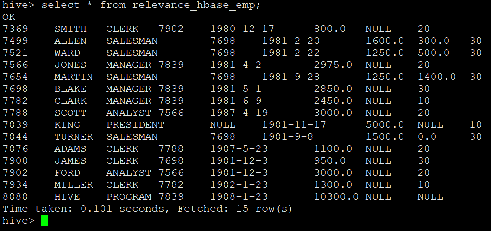

#   第 5 章 HBase 优化  

##   5.2 预分区  

  每一个 region 维护着 StartRow 与 EndRow，如果加入的数据符合某个 Region 维护的
RowKey 范围，则该数据交给这个 Region 维护。那么依照这个原则，我们可以将数据所要
投放的分区提前大致的规划好，以提高 HBase 性能。
1． 手动设定预分区  

```
create 'staff1','info','partition1',SPLITS =>['1000','2000','3000','4000']
```

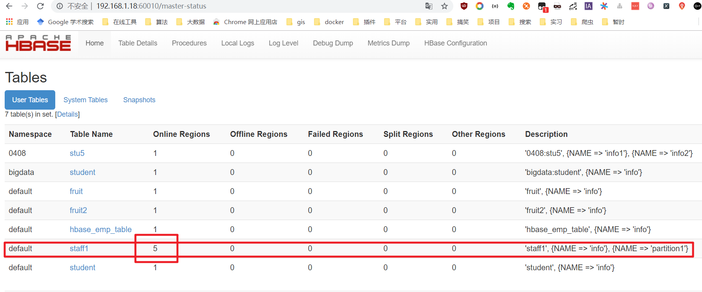

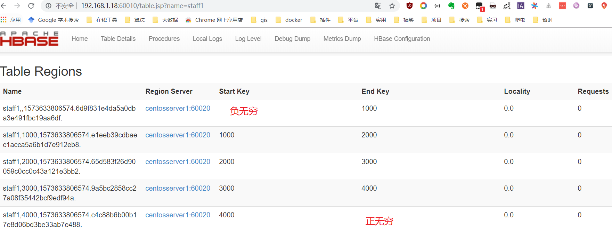

##   5.3 RowKey 设计

设计原则：

1. 散列性
2. 唯一性
3. 长度原则：70-100

---


#   第 6 章 HBase 实战之谷粒微博  


## 一、谷粒微博表设计

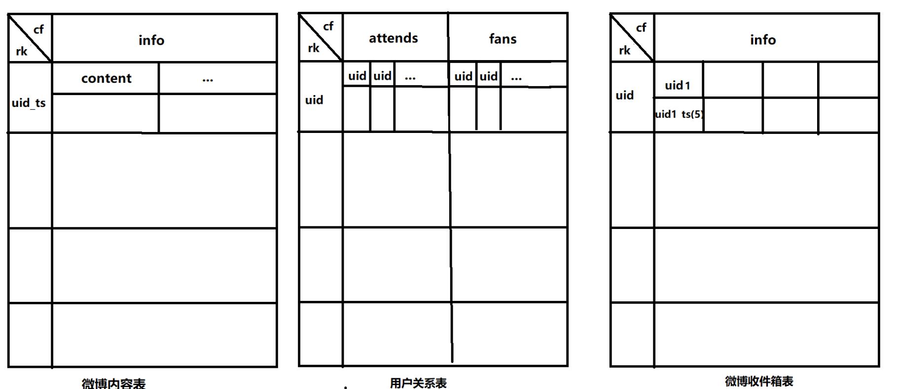

## 二、程序编写

### 1.新建程序

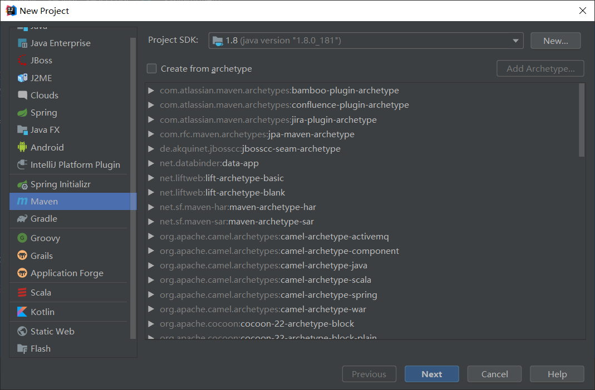

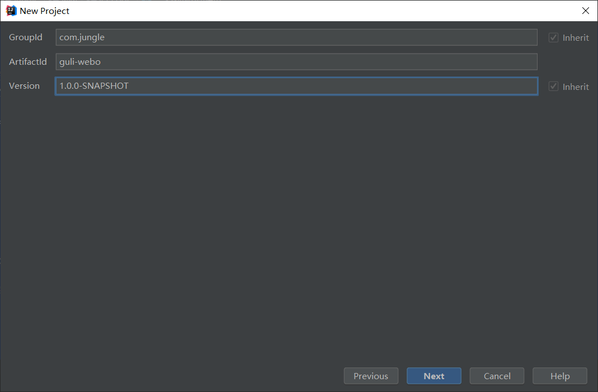

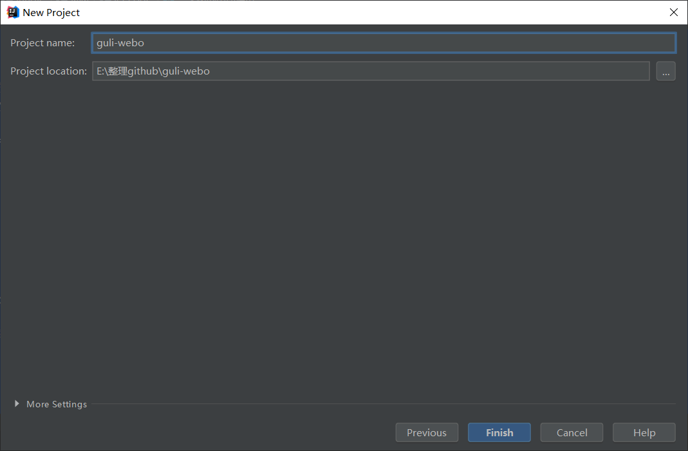

+ pom.xml

```xml
  <?xml version="1.0" encoding="UTF-8"?>
<project xmlns="http://maven.apache.org/POM/4.0.0"
         xmlns:xsi="http://www.w3.org/2001/XMLSchema-instance"
         xsi:schemaLocation="http://maven.apache.org/POM/4.0.0 http://maven.apache.org/xsd/maven-4.0.0.xsd">
    <modelVersion>4.0.0</modelVersion>

    <groupId>com.jungle</groupId>
    <artifactId>guli-webo</artifactId>
    <version>1.0.0-SNAPSHOT</version>

    <properties>
        <hbase.version>1.2.0-cdh5.7.0</hbase.version>
    </properties>
    <repositories>
        <repository>
            <id>cloudera</id>
            <name>cloudera Repository</name>
            <url>https://repository.cloudera.com/artifactory/cloudera-repos</url>
        </repository>
    </repositories>
    <dependencies>
        <dependency>
            <groupId>org.apache.hbase</groupId>
            <artifactId>hbase-client</artifactId>
            <version>${hbase.version}</version>
        </dependency>
        <dependency>
            <groupId>org.apache.hbase</groupId>
            <artifactId>hbase-server</artifactId>
            <version>${hbase.version}</version>
        </dependency>
    </dependencies>
</project>
```

 hbase-site.xml

```xml
<?xml version="1.0"?>
<?xml-stylesheet type="text/xsl" href="configuration.xsl"?>
<!--
/**
 *
 * Licensed to the Apache Software Foundation (ASF) under one
 * or more contributor license agreements.  See the NOTICE file
 * distributed with this work for additional information
 * regarding copyright ownership.  The ASF licenses this file
 * to you under the Apache License, Version 2.0 (the
 * "License"); you may not use this file except in compliance
 * with the License.  You may obtain a copy of the License at
 *
 *     http://www.apache.org/licenses/LICENSE-2.0
 *
 * Unless required by applicable law or agreed to in writing, software
 * distributed under the License is distributed on an "AS IS" BASIS,
 * WITHOUT WARRANTIES OR CONDITIONS OF ANY KIND, either express or implied.
 * See the License for the specific language governing permissions and
 * limitations under the License.
 */
-->
<configuration>
    <property>
        <name>hbase.rootdir</name>
        <value>hdfs://192.168.1.18:8020/hbase</value>
    </property>

    <property>
        <name>hbase.cluster.distributed</name>
        <value>true</value>
    </property>

    <property>
        <name>hbase.zookeeper.quorum</name>
        <value>192.168.1.18:2181</value>
    </property>


</configuration>

```

+ 目录结构

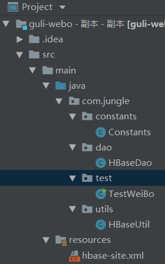

--Constants.java

```java
package com.jungle.constants;

import org.apache.hadoop.conf.Configuration;
import org.apache.hadoop.hbase.HBaseConfiguration;

public class Constants {

    //读取resources目录下hbase-site.xml中的配置
    public static final Configuration CONFIGURATION = HBaseConfiguration.create();

    //命名空间
    public static final String NAMESPACE = "weibo";

    //微博内容表
    public static final String CONTENT_TABLE = "weibo:content";
    public static final String CONTENT_TABLE_CF = "info";
    public static final int CONTENT_TABLE_VERSIONS = 1;


    //用户关系表
    public static final String RELATION_TABLE = "weibo:relation";
    public static final String RELATION_TABLE_CF1 = "attends";
    public static final String RELATION_TABLE_CF2 = "fans";
    public static final int RELATION_TABLE_VERSIONS = 1;

    //收件箱表
    public static final String INBOX_TABLE = "weibo:inbox";
    public static final String INBOX_TABLE_CF = "info";
    public static final int INBOX_TABLE_VERSIONS = 2;


}

```

--HBaseDao.java

```java
package com.jungle.dao;

import com.jungle.constants.Constants;
import org.apache.hadoop.hbase.Cell;
import org.apache.hadoop.hbase.CellUtil;
import org.apache.hadoop.hbase.TableName;
import org.apache.hadoop.hbase.client.*;
import org.apache.hadoop.hbase.filter.CompareFilter;
import org.apache.hadoop.hbase.filter.RowFilter;
import org.apache.hadoop.hbase.filter.SubstringComparator;
import org.apache.hadoop.hbase.util.Bytes;
import org.apache.hadoop.hbase.client.Put;

import java.io.IOException;
import java.util.ArrayList;

/**
 * 1.发布微博
 * 2.删除微博
 * 3.关注用户
 * 4.取关用户
 * 5.获取用户微博详情
 * 6.获取用户的初始化页面
 */
public class HBaseDao {

    /**
     * 1.发布微博
     * @param uid
     * @param content
     */
    public static void publishWeiBo(String uid,String content) throws IOException {

        //获取Connection对象
        Connection connection = ConnectionFactory.createConnection(Constants.CONFIGURATION);

        //第一部分：操作微博内容表
        //1.获取微博内容表对象
        Table conTable = connection.getTable(TableName.valueOf(Constants.CONTENT_TABLE));

        //2.获取当前时间戳
        long ts = System.currentTimeMillis();

        //3.获取RowKey
        String rowKey = uid + "_" + ts;

        //4.获取Put对象
        Put contPut = new Put(Bytes.toBytes(rowKey));

        //5.给Put对象赋值
        contPut.addColumn(Bytes.toBytes(Constants.CONTENT_TABLE_CF),Bytes.toBytes("content"),
                Bytes.toBytes(content));

        //6.执行插入数据操作
        conTable.put(contPut);


        //第二部分：操作微博收件箱
        //1.获取用户关系对象
        Table relaTable = connection.getTable(TableName.valueOf(Constants.RELATION_TABLE));

        //2.获取当前发布微博人的fans列族数据
        Get get = new Get(Bytes.toBytes(uid));
        get.addFamily(Bytes.toBytes(Constants.RELATION_TABLE_CF2));
        Result result = relaTable.get(get);

        //3.创建一个集合，用于存放微博内容表的Put对象
        ArrayList<Put> inboxPuts = new ArrayList<>();

        //4.遍历粉丝
        for (Cell cell : result.rawCells()) {

            //5.构建微博收件箱表的Put对象
            Put inboxPut = new Put(CellUtil.cloneQualifier(cell));


            //6.给收件箱的Put对象赋值
            inboxPut.addColumn(Bytes.toBytes(Constants.INBOX_TABLE_CF),Bytes.toBytes(uid),
                    Bytes.toBytes(rowKey));

            //7.将收件箱表的Put对象存入集合
            inboxPuts.add(inboxPut);

            //8.判断是否有粉丝
            if (inboxPuts.size() > 0) {

                //获取收件箱表对象
                Table inboxTable = connection.getTable(TableName.valueOf(Constants.INBOX_TABLE));

                //执行收件箱表数据插入操作
                inboxTable.put(inboxPuts);

                //关闭收件箱
                inboxTable.close();

            }

            //关闭资源
            relaTable.close();
            conTable.close();
            connection.close();


        }
    }


    /**
     * 2.关注用户
     * @param uid
     * @param attends
     */
    public static void addAttends(String uid,String... attends) throws IOException {

        //校验是否添加待关注的人
        if (attends.length <= 0) {
            System.out.println("请选择待关注的人！！！");
            return;
        }

        //获取Connection对象
        Connection connection = ConnectionFactory.createConnection(Constants.CONFIGURATION);

        //第一部分：操作用户关系表
        //1.获取用户关系表对象
        Table relaTable = connection.getTable(TableName.valueOf(Constants.RELATION_TABLE));

        //2.创建一个集合，用于存放用户关系表的Put对象
        ArrayList<Put> relaPuts = new ArrayList<>();

        //3.创建操作者的Put对象
        Put uidPut = new Put(Bytes.toBytes(uid));

        //4.循环创建被关注者的Put对象
        for (String attend : attends) {

            //5.给操作者的Put对象赋值
            uidPut.addColumn(Bytes.toBytes(Constants.RELATION_TABLE_CF1),Bytes.toBytes(attend),
                    Bytes.toBytes(attend));

            //6.创建被关注者的Put对象
            Put attendPut = new Put(Bytes.toBytes(attend));

            //7.给被关注者的Put对象赋值
            attendPut.addColumn(Bytes.toBytes(Constants.RELATION_TABLE_CF2),Bytes.toBytes(uid),
                    Bytes.toBytes(uid));

            //8.将被关注者的Put对象放入集合
            relaPuts.add(attendPut);

        }

        //9.将操作者的Put对象添加至集合
        relaPuts.add(uidPut);

        //10.执行用户关系表的插入数据操作
        relaTable.put(relaPuts);


        //第二部分：操作收件箱表
        //1.获取微博内容表对象
        Table contTable = connection.getTable(TableName.valueOf(Constants.CONTENT_TABLE));

        //2.创建收件箱表的Put对象
        Put inboxPut = new Put(Bytes.toBytes(uid));

        //3.循环attends，获取每个被关注者近期发布的微博
        for (String attend : attends) {

            //4.获取当前被关注者的近期发布的微博（scan）->集合ResultScanner
            //starrow stoprow
            Scan scan = new Scan(Bytes.toBytes(attend + "_"), Bytes.toBytes(attend + "|"));

            ResultScanner resultScanner = contTable.getScanner(scan);

            //定义一个时间戳
            //保证时间戳不统一
            long ts = System.currentTimeMillis();

            //5.对获取的值进行遍历
            for (Result result : resultScanner) {

                //6.给收件箱表的Put对象赋值
                inboxPut.addColumn(Bytes.toBytes(Constants.INBOX_TABLE_CF),Bytes.toBytes(attend),ts++,result.getRow());
            }

        }

        //7.判断当前的Put对象是否为空
        if (!inboxPut.isEmpty()) {

            //获取收件箱表对象
            Table inboxTable = connection.getTable(TableName.valueOf(Constants.INBOX_TABLE));


            //插入数据
            inboxTable.put(inboxPut);

            //关闭收件箱表连接
            inboxTable.close();

            //关闭资源
            relaTable.close();
            contTable.close();
            connection.close();

        }
    }

    /**
     * 3.取关
     * @param uid
     * @param dels
     */
    public static void deleteAttends(String uid,String... dels) throws IOException {

        if (dels.length <= 0) {
            System.out.println("请添加待取关的用户！！！");
            return;
        }

        //获取Connnection对象
        Connection connection = ConnectionFactory.createConnection(Constants.CONFIGURATION);


        //第一部分：操作用户关系表
        //1.获取用户关系表对象
        Table relaTable = connection.getTable(TableName.valueOf(Constants.RELATION_TABLE));


        //2.创建一个集合，用于存放用户关系表的Delete对象
        ArrayList<Delete> relaDeletes = new ArrayList<>();

        //3.创建操作者的Delete对象
        Delete uidDelete = new Delete(Bytes.toBytes(uid));

        //4.循环创建被取关者的Delete对象
        for (String del : dels) {

            //5.给操作者的Delete对象
            uidDelete.addColumns(Bytes.toBytes(Constants.RELATION_TABLE_CF1),
                    Bytes.toBytes(del));

            //6.创建被取关者的Delete对象
            Delete delDelete = new Delete(Bytes.toBytes(del));

            //7.给被取关者的Delete对象赋值
            delDelete.addColumns(Bytes.toBytes(Constants.RELATION_TABLE_CF2),
                    Bytes.toBytes(uid));

            //8.将被取关者的Delete对象添加至集合
            relaDeletes.add(delDelete);

        }

        //9.将操作者的Delete对象添加至集合
        relaDeletes.add(uidDelete);

        //10.执行用户关系表的删除操作
        relaTable.delete(relaDeletes);


        //第二部分：操作收件箱表
        //1.获取收件箱表对象
        Table inboxTable = connection.getTable(TableName.valueOf(Constants.INBOX_TABLE));


        //2.创建操作者的Delete对象
        Delete inboxDelete = new Delete(Bytes.toBytes(uid));

        //3.给操作者的Delete对象赋值
        for (String del : dels) {
            inboxDelete.addColumns(Bytes.toBytes(Constants.INBOX_TABLE_CF), Bytes.toBytes(del));
        }

        //4.执行收件箱表的删除操作
        inboxTable.delete(inboxDelete);

        //关闭资源
        relaTable.close();
        inboxTable.close();
        connection.close();

    }

    /**
     * 4.获取某个人的初始化页面数据
     * @param uid
     */
    public static void getInit(String uid) throws IOException {

        //1.获取Connection对象
        Connection connection = ConnectionFactory.createConnection(Constants.CONFIGURATION);

        //2.获取收件箱表对象
        Table inboxTable = connection.getTable(TableName.valueOf(Constants.INBOX_TABLE));

        //3.获取微博内容表对象
        Table contTable = connection.getTable(TableName.valueOf(Constants.CONTENT_TABLE));

        //4.创建收件箱表Get对象，并获取数据（设置最大版本）
        Get inboxGet = new Get(Bytes.toBytes(uid));
        inboxGet.setMaxVersions();
        Result result = inboxTable.get(inboxGet);

        //5.遍历获取的数据
        for (Cell cell : result.rawCells()) {

            //6.构建微博内容表Get对象
            Get contGet = new Get(CellUtil.cloneValue(cell));

            //7.获取Get对象的数据内容
            Result contResult = contTable.get(contGet);

            //8.解析内容并打印
            for (Cell contCell : contResult.rawCells()) {

                System.out.println("RK:" + Bytes.toString(CellUtil.cloneRow(contCell)) +
                        ",CF:" + Bytes.toString(CellUtil.cloneFamily(contCell)) +
                        ",CN:" + Bytes.toString(CellUtil.cloneQualifier(contCell)) +
                        ",Value:" + Bytes.toString(CellUtil.cloneValue(contCell)));
            }
        }

        //9.关闭资源
        inboxTable.close();
        contTable.close();
        connection.close();

    }

    /**
     * 5.获取某个人的所有微博详情
     * @param uid
     */
    public static void getWeiBo(String uid) throws IOException {

        //1.获取Connection对象
        Connection connection = ConnectionFactory.createConnection(Constants.CONFIGURATION);

        //2.获取微博内容表对象
        Table table = connection.getTable(TableName.valueOf(Constants.CONTENT_TABLE));

        //3.构建Scan对象
        Scan scan = new Scan();
        //构建过滤器
        RowFilter rowFilter = new RowFilter(CompareFilter.CompareOp.EQUAL, new SubstringComparator(uid + "_"));
        scan.setFilter(rowFilter);

        //4.获取数据
        ResultScanner resultScanner = table.getScanner(scan);

        //5.解析数据并打印
        for (Result result : resultScanner) {
            for (Cell cell : result.rawCells()) {

                System.out.println("RK:" + Bytes.toString(CellUtil.cloneRow(cell)) +
                        ",CF:" + Bytes.toString(CellUtil.cloneFamily(cell)) +
                        ",CN:" + Bytes.toString(CellUtil.cloneQualifier(cell)) +
                        ",Value:" + Bytes.toString(CellUtil.cloneValue(cell)));
            }

        }

        //6.关闭资源
        table.close();
        connection.close();

    }
}

```

--TestWeiBo.java

```java
package com.jungle.test;

import com.jungle.constants.Constants;
import com.jungle.dao.HBaseDao;
import com.jungle.utils.HBaseUtil;

import java.io.IOException;

public class TestWeiBo {

    public static void init() {


        try {
            //创建命名空间
            HBaseUtil.createNameSpace(Constants.NAMESPACE);

            //创建微博内容表
            HBaseUtil.createTable(Constants.CONTENT_TABLE,Constants.CONTENT_TABLE_VERSIONS,
                    Constants.CONTENT_TABLE_CF);
            System.out.println("内容表已好");

            //创建用户关系表
            HBaseUtil.createTable(Constants.RELATION_TABLE,Constants.RELATION_TABLE_VERSIONS,Constants.RELATION_TABLE_CF1, Constants.RELATION_TABLE_CF2);
            System.out.println("用户关系表已好");

            //创建收件箱表
            HBaseUtil.createTable(Constants.INBOX_TABLE,Constants.INBOX_TABLE_VERSIONS,
                    Constants.INBOX_TABLE_CF);
            System.out.println("收件箱表已好");

        } catch (IOException e) {
            e.printStackTrace();
        }


    }

    public static void main(String[] args) throws IOException, InterruptedException {

        //初始化
        init();

        //1001发布微博
        HBaseDao.publishWeiBo("1001","赶紧下课吧！！！");

        //1002关注1001和1003
        HBaseDao.addAttends("1002","1001","1003");

        //获取1002初始化页面
        HBaseDao.getInit("1002");

        System.out.println("~~~~~~~~~~~~~~111~~~~~~~~~~~~~~");

        //1003发布3条微博，同时1001发布2条微博
        HBaseDao.publishWeiBo("1003","谁说得赶紧下课！！！！");
        Thread.sleep(10);

        HBaseDao.publishWeiBo("1001","我没说话！！！！");
        Thread.sleep(10);

        HBaseDao.publishWeiBo("1003","那谁说的！！！！");
        Thread.sleep(10);

        HBaseDao.publishWeiBo("1001","反正飞机下线了！！！！");
        Thread.sleep(10);

        HBaseDao.publishWeiBo("1001","你们爱咋咋地！！！！");
        Thread.sleep(10);

        //获取1002初始化页面
        HBaseDao.getInit("1002");

        System.out.println("~~~~~~~~~~~~~~222~~~~~~~~~~~~~~");


        //1002取关1003
        HBaseDao.deleteAttends("1002","1003");

        //获取1002初始化页面
        HBaseDao.getInit("1002");
        System.out.println("~~~~~~~~~~~~~~333~~~~~~~~~~~~~~");

        //1002再次关注1003
        HBaseDao.addAttends("1002","1003");

        //获取1002初始化页面
        HBaseDao.getInit("1002");
        System.out.println("~~~~~~~~~~~~~~444~~~~~~~~~~~~~~");

        //获取1001微博详情
        HBaseDao.getWeiBo("1001");
    }
}

```

--HBaseUtil.java

```java

package com.jungle.utils;

import com.jungle.constants.Constants;
import org.apache.hadoop.hbase.HColumnDescriptor;
import org.apache.hadoop.hbase.HTableDescriptor;
import org.apache.hadoop.hbase.NamespaceDescriptor;
import org.apache.hadoop.hbase.TableName;
import org.apache.hadoop.hbase.client.Admin;
import org.apache.hadoop.hbase.client.Connection;
import org.apache.hadoop.hbase.client.ConnectionFactory;

import java.io.IOException;

/**
 * 1.创建命名空间
 * 2.判断表是否存在
 * 3.创建表（三张表）
 */
public class HBaseUtil {

    /**
     * 1.创建命名空间
     * @param nameSpace
     * @throws IOException
     */
    public static void createNameSpace(String nameSpace) throws IOException {

        //1.获取Connection对象
        Connection connection = ConnectionFactory.createConnection(Constants.CONFIGURATION);

        //2.获取Admin对象
        Admin admin = connection.getAdmin();

        //3.构建命名空间描述器
        NamespaceDescriptor namespaceDescriptor = NamespaceDescriptor.create(nameSpace).build();


        //4.创建命名空间
        admin.createNamespace(namespaceDescriptor);

        //5.关闭资源
        admin.close();
        connection.close();


    }

    /**
     * 2.判断表是否存在
     * @param tableName
     * @return
     */
    private static boolean isTableExist(String tableName) throws IOException {

        //1.获取Connection对象
        Connection connection = ConnectionFactory.createConnection(Constants.CONFIGURATION);

        //2.获取Admin对象
        Admin admin = connection.getAdmin();

        //3.判断是否存在
        boolean exists = admin.tableExists(TableName.valueOf(tableName));

        //4.关闭资源
        admin.close();
        connection.close();

        //返回结果
        return exists;


    }

    /**
     * 3.创建表
     * @param tableName
     * @param versions
     * @param cfs
     */
    public static void createTable(String tableName,int versions,String... cfs) throws IOException {

            //1.判断是否存在列簇信息
            if (cfs.length <= 0) {
                System.out.println("请设置列簇信息！");
                return;
            }

            //2.判断表是否存在
            if (isTableExist(tableName)) {
                System.out.println(tableName + "表已存在");
                return;
            }
            //3.获取Connection对象
            Connection connection = ConnectionFactory.createConnection(Constants.CONFIGURATION);

            //4.获取Admin对象
            Admin admin = connection.getAdmin();

            //5.创建表描述器
            HTableDescriptor hTableDescriptor = new HTableDescriptor(TableName.valueOf(tableName));

            //6.循环添加列族信息
            for (String cf : cfs) {

                //7.创建列族描述器
                HColumnDescriptor hColumnDescriptor = new HColumnDescriptor(cf);

                hColumnDescriptor.setMaxVersions(versions);
                //8.添加具体的列簇信息
                hTableDescriptor.addFamily(hColumnDescriptor);
            }

            //9.创建表
            admin.createTable(hTableDescriptor);

            //关闭资源
            admin.close();
            connection.close();

        }

    }


```

----

